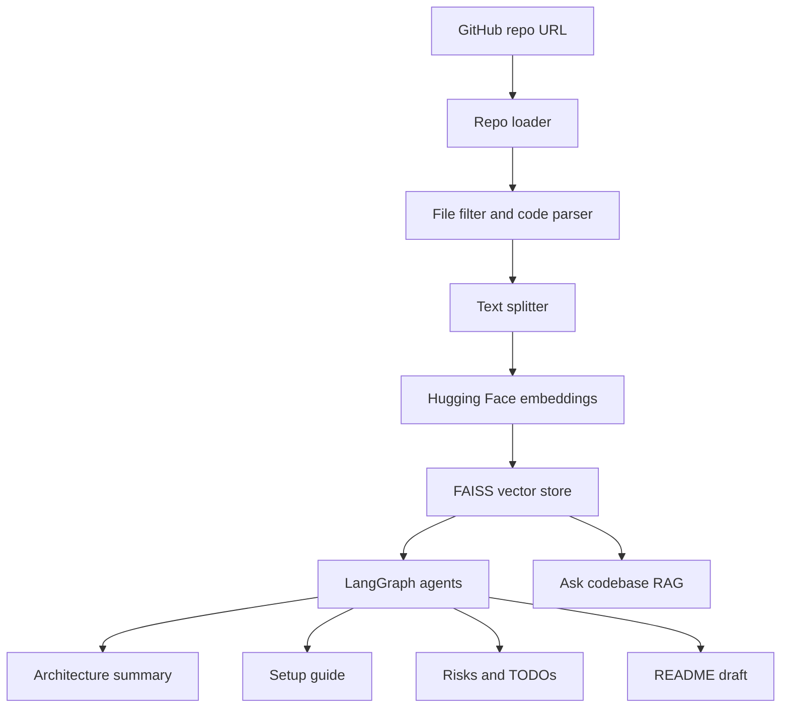

# Agentic GitHub Codebase Intelligence Platform

An end-to-end AI agent project that analyzes public GitHub repositories and explains the codebase using **LangChain**, **LangGraph**, **FAISS**, local Hugging Face embeddings, and free LLM fallback with **Gemini**, **Groq**, and **Mistral**.

The project is built by Vatsal Dhuvad as a professional AI/ML and Agentic AI portfolio project.

## What it does

- Accepts a public GitHub repository URL
- Clones the repo safely with size and file limits
- Filters source files and ignores heavy folders such as `.git`, `node_modules`, `.venv`, `dist`, and `build`
- Builds local embeddings with `sentence-transformers/all-MiniLM-L6-v2`
- Stores code chunks in FAISS
- Runs LangGraph agents for architecture, setup guide, walkthrough, risks/TODOs, and README generation
- Lets users ask RAG-based questions about the codebase
- Exports full analysis report as Markdown
- Includes Docker, FastAPI route, tests, and GitHub Actions

## Tech stack

- Python
- Streamlit
- FastAPI
- LangChain
- LangGraph
- FAISS
- Hugging Face embeddings
- Gemini API
- Groq API
- Mistral API
- GitPython
- NetworkX
- Pydantic
- Docker
- Pytest
- GitHub Actions

## Project structure

```text
agentic_github_codebase_explainer/
  README.md
  requirements.txt
  .env.example
  .gitignore
  Dockerfile
  docker-compose.yml
  config.yaml
  main.py
  app.py
  src/
    agent/
      workflow.py
    tools/
      repo_loader.py
      code_parser.py
      dependency_graph.py
      vector_store.py
    models/
      embeddings.py
      llm_client.py
      schemas.py
    prompts/
      system_prompts.py
    utils/
      file_utils.py
      text.py
    api/
      routes.py
  tests/
  data/
  logs/
```

## Architecture



## Local setup

Create environment:

```powershell
cd "C:\Users\vatsa\OneDrive\Desktop\agentic_github_codebase_explainer"
python -m venv .venv
.venv\Scripts\activate
pip install -r requirements.txt
```

Create `.env`:

```text
GEMINI_API_KEY=your_gemini_api_key_here
GROQ_API_KEY=your_groq_api_key_here
MISTRAL_API_KEY=your_mistral_api_key_here
GITHUB_TOKEN=optional_github_token_for_higher_rate_limit
```

At least one LLM key is recommended. If no key is added, the app still gives local-only summaries, but full AI sections will be limited.

Run Streamlit:

```powershell
streamlit run app.py
```

Run FastAPI:

```powershell
uvicorn src.api.routes:app --reload
```

## Docker

Build and run Streamlit:

```powershell
docker build -t github-codebase-explainer .
docker run --env-file .env -p 8501:8501 github-codebase-explainer
```

Run Streamlit + API with Docker Compose:

```powershell
docker compose up --build
```

## Streamlit Cloud deployment

1. Push the project to GitHub.
2. Create a new app on Streamlit Community Cloud.
3. Select `app.py` as the main file.
4. Add secrets:

```toml
GEMINI_API_KEY = "your_gemini_api_key_here"
GROQ_API_KEY = "your_groq_api_key_here"
MISTRAL_API_KEY = "your_mistral_api_key_here"
```

5. Deploy.

## Example questions

- What does this repository do?
- Which files should I read first?
- How do I run this project locally?
- Explain the architecture.
- Find TODOs and risks.
- Generate a README.

## Resume line

Built an Agentic GitHub Codebase Intelligence Platform using LangChain, LangGraph, Streamlit, FastAPI, FAISS, Hugging Face embeddings, GitPython, NetworkX, Docker, and Gemini/Groq/Mistral fallback to analyze repositories, explain architecture, generate setup guides, detect TODOs/risks, and create developer-ready documentation.

